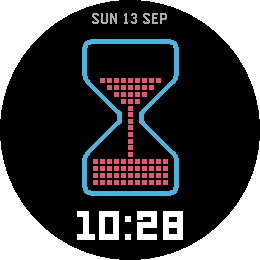
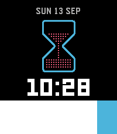
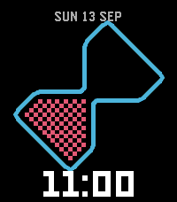

# Pixel Hourglass

A Pebble watchface that shows a stretch of time as an hourglass. Sand drains from
the upper chamber as the cycle runs, and the glass flips over when a new one
begins — so how much is left reads off the shape of the pile, without reading the
digits.

The sand is drawn as separate grains, and it drops a row at a time rather than
pouring.

<p>
  
  
</p>

## Screen

- **Date** above the glass — `SUN 13 SEP`.
- **Hourglass** in the middle — the upper chamber is what is left of the cycle.
- **Time** below, in large digits, 12- or 24-hour following the watch setting.

The layout follows the unobstructed area, so the glass shrinks instead of hiding
behind the Timeline Quick View peek. The flip is the only animation on the
screen.

<p>
  
  
</p>

## Settings

One setting, on the phone: **Time for the sand to run out** — and so how often
the glass flips. Choose from 1 minute, 10 minutes, 30 minutes, 1 hour, 12 hours
or 24 hours; the default is one hour.

All six divide the day evenly, and cycles are counted from local midnight.
Changing the setting does not flip the glass — the sand moves to the level the new
cycle is already at.

Shorter cycles redraw the screen more often and cost more battery.

## Building and installing

Requires the Pebble SDK — built and tested on 4.17.

```sh
npm install
pebble build
pebble install --phone <phone-ip>
```

`--phone` wants the address the Pebble app shows once developer connection is
switched on.

To run it in the emulator instead:

```sh
pebble install --emulator emery --logs
pebble install --emulator gabbro --logs
```

Targets `emery` (Pebble Time 2) and `gabbro` (Pebble Round 2).

## License

MIT — see [LICENSE](LICENSE).
